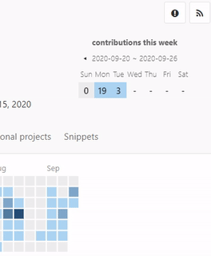
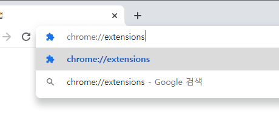
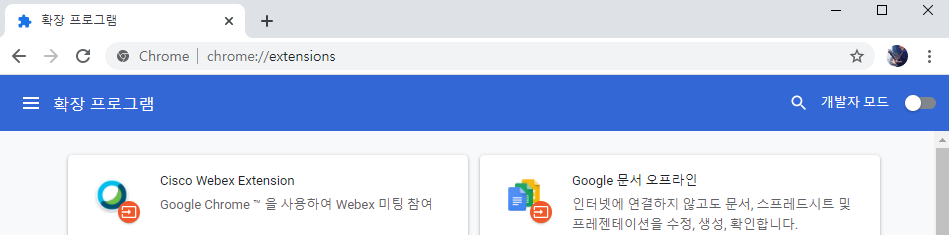
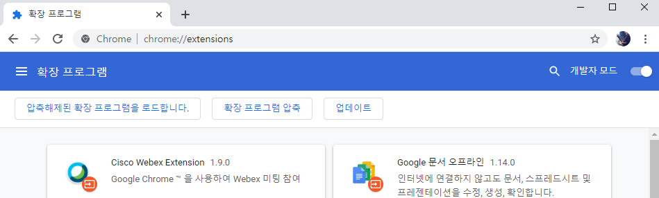
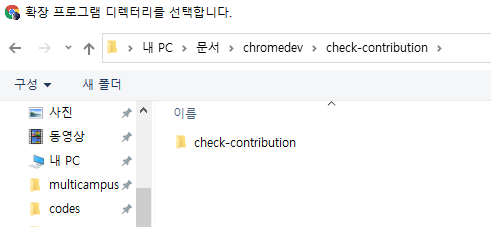
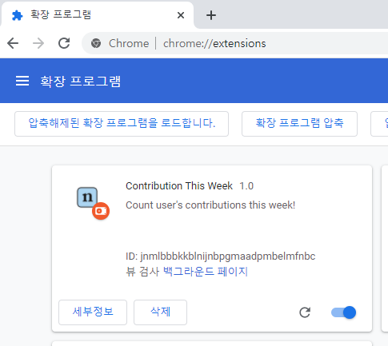
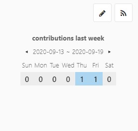

# contrib-this-week

gitlab상에서 사용자의 이번 주 컨트리뷰션 내역을 한 눈에 확인할 수 있습니다 !



---

## Version History

`v2.0.0`

- 사용자 정보의 `calendar.json` 내용을 `fetch API`를 통해 불러오도록 추가하였습니다.

- ***.gitlab.com** 의 형식으로 된 gitlab에서도 동일하게 동작합니다.

`v1.0.0` 

- 사용자 페이지에 로드된 calendar를 바탕으로 현재의 contribution 내역을 나타냅니다.


## Installation

1. 이 리포지토리를 클론합니다.
	```bash
	git clone https://lab.ssafy.com/ssafy_coach_28/contrib-this-week.git
	```

2. 크롬 확장 프로그램 관리 페이지로 들어갑니다.
	
	


3. 개발자 모드를 활성화합니다.
	
	
	_활성화 전_
	
	
	_활성화 후_

4. 좌측 상단의 `[unpack loaded]` 또는  `[압축해제된 확장프로그램을 로드합니다]`를 선택합니다.
	
	


5. 클론 받은 경로를 찾아가서 **`manifest.json`이 있는 폴더를 선택**합니다.
	
	

6. 등록된 확장 프로그램을 활성화합니다.
	
	

7. 끝!
	
	